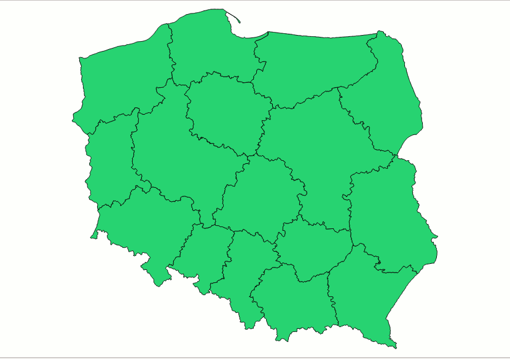
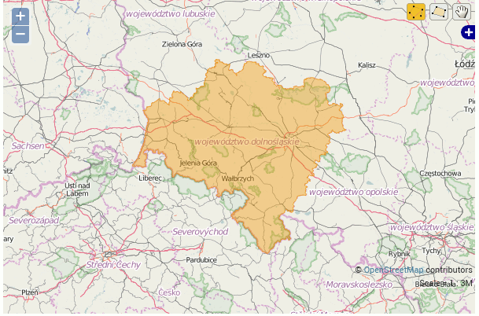

**Today is the day, when I will start my blog. I would like to publish
new posts once a week.** **The comments and feedback will be pretty much
appreciated as I have just started blogging in English.**

I assume that the Reader knows how to run basic Django application.
However, if this is not the case, I encourage you to start
[here](https://docs.djangoproject.com/en/1.9/intro/tutorial01/).

So, let's start:

First of all, what is GeoDjango?

From official geodjango
[documentation](https://docs.djangoproject.com/en/dev/ref/contrib/gis/):

> GeoDjango intends to be a world-class geographic Web framework. Its
> goal is to make it as easy as possible to build GIS Web applications
> and harness the power of spatially enabled data.

To run GeoDjango you have to install some additional packages. In ubuntu
you can easily do this way:

```console
$ sudo apt-get install binutils libproj-dev gdal-bin
```

Gdal-bin package is not necessary but it's very helpful so I encourage
to install it.

Then you need to choose what database you will use with your GeoDjango
project. I personally chosen PostgreSQL with PostGIS because it support
all of the GeoDjango features according to this
[table](https://docs.djangoproject.com/en/dev/ref/contrib/gis/db-api/#spatial-lookup-compatibility).

After starting project, and making new application add few lines to your
settings.py:

```python
DATABASES = {
'default': {
     'ENGINE': 'django.contrib.gis.db.backends.postgis',
     'NAME': 'your_database_name',
     'USER': 'your_user',
     'PASSWORD': 'your_password',
     'HOST': 'localhost',
     'PORT': '5432',
    }
}
```

and modify INSTALLED\_APPS:

```python
INSTALLED_APPS = (
    'django.contrib.admin',
    'django.contrib.auth',
    'django.contrib.contenttypes',
    'django.contrib.sessions',
    'django.contrib.messages',
    'django.contrib.staticfiles',
    'django.contrib.gis',
    'name_of_your_applications' # in my case voivodeships
 )
```

To actually show some data we need it first. In this project I'll use
[shp](https://en.wikipedia.org/wiki/Shapefile) files and points with
coordinates.

There is a lot of sites with free shp files available but I will choose
one for Poland. The shapefiles are in zip file. So go and grab them:

```shell
wget ftp://91.223.135.109/prg/jednostki_administracyjne.zip
$ mkdir data && unzip jednostki_administracyjne.zip -d data
```

I'm going to use only 1 shapefile from this zip called 'województwa.shp'
(voivodeships). After unziping you want to examine contents of
shapefiles. You can do it in tool like
[QuantumGIS](http://www.qgis.org/pl/site/) or use GDAL ogrinfo.

In QGIS this shapefile presents as follows:



Using ogrinfo:

```terminal
$ ogrinfo -so data/PRG_jednostki_administracyjne_v10/województwa.shp województwa

INFO: Open of `data/PRG_jednostki_administracyjne_v10/województwa.shp'
 using driver `ESRI Shapefile' successful.

Layer name: województwa
Geometry: Polygon
Feature Count: 16
Extent: (171677.555190, 133223.725152) - (861895.746988, 774923.747473)
Layer SRS WKT:
PROJCS["ETRS89 / Poland CS92",
   GEOGCS["ETRS89",
       DATUM["European Terrestrial Reference System 1989",
           SPHEROID["GRS 1980",6378137.0,298.257222101],
           TOWGS84[0,0,0]],
       PRIMEM["Greenwich",0.0],
       UNIT["Decimal Degree",0.017453292519943295]],
   PROJECTION["Transverse_Mercator"],
   PARAMETER["latitude_of_origin",0.0],
   PARAMETER["central_meridian",18.999999999999982],
   PARAMETER["scale_factor",0.9993],
   PARAMETER["false_easting",500000.0],
   PARAMETER["false_northing",-5300000.0],
   UNIT["Meter",1.0],
   AUTHORITY["EPSG","2180"]]
   iip_przest: String (255.0)
   iip_identy: String (255.0)
   iip_wersja: String (255.0)
   jpt_sjr_ko: String (255.0)
   jpt_kod_je: String (255.0)
   jpt_nazwa_: String (255.0)
   jpt_nazw01: String (255.0)
   jpt_organ_: String (255.0)
   jpt_orga01: String (255.0)
   jpt_jor_id: Real (32.0)
   wazny_od: Date (10.0)
   wazny_do: Date (10.0)
   jpt_wazna_: String (255.0)
   wersja_od: Date (10.0)
   wersja_do: Date (10.0)
   jpt_powier: Real (33.16)
   jpt_kj_iip: String (255.0)
   jpt_kj_i01: String (255.0)
   jpt_kj_i02: String (255.0)
   jpt_kod_01: String (255.0)
   id_bufora_: Real (32.0)
   id_bufor01: Real (32.0)
   id_technic: Real (32.0)
   jpt_opis: String (255.0)
   jpt_sps_ko: String (255.0)
   gra_ids: String (255.0)
   status_obi: String (255.0)
   opis_bledu: String (255.0)
   typ_bledu: String (255.0)
```

We can make model representing this data in our application by hand but
it's django so you can type:

```console
$ ./manage.py ogrinspect data/PRG_jednostki_administracyjne_v10/województwa.shp Voivodeship --mapping --srid 2180 --multi >> voivodeships/models.py
```

Where --mapping tells you to generate mapping used to load data from
shapefile, --srid sets the [SRID](https://en.wikipedia.org/wiki/SRID)
for the geographic field and --multi sets geographic field to
MultiPolygonField

Our voivodeships/models.py will look like this:

```python
from __future__ import unicode_literals
# This is an auto-generated Django model module created by ogrinspect.
from django.contrib.gis.db import models

class Voivodeship(models.Model):
    iip_przest = models.CharField(max_length=255)
    iip_identy = models.CharField(max_length=255)
    iip_wersja = models.CharField(max_length=255)
    jpt_sjr_ko = models.CharField(max_length=255)
    jpt_kod_je = models.CharField(max_length=255)
    jpt_nazwa_field = models.CharField(max_length=255)
    jpt_nazw01 = models.CharField(max_length=255)
    jpt_organ_field = models.CharField(max_length=255)
    jpt_orga01 = models.CharField(max_length=255)
    jpt_jor_id = models.FloatField()
    wazny_od = models.DateField()
    wazny_do = models.DateField()
    jpt_wazna_field = models.CharField(max_length=255)
    wersja_od = models.DateField()
    wersja_do = models.DateField()
    jpt_powier = models.FloatField()
    jpt_kj_iip = models.CharField(max_length=255)
    jpt_kj_i01 = models.CharField(max_length=255)
    jpt_kj_i02 = models.CharField(max_length=255)
    jpt_kod_01 = models.CharField(max_length=255)
    id_bufora_field = models.FloatField()
    id_bufor01 = models.FloatField()
    id_technic = models.FloatField()
    jpt_opis = models.CharField(max_length=255)
    jpt_sps_ko = models.CharField(max_length=255)
    gra_ids = models.CharField(max_length=255)
    status_obi = models.CharField(max_length=255)
    opis_bledu = models.CharField(max_length=255)
    typ_bledu = models.CharField(max_length=255)
    geom = models.MultiPolygonField(srid=2180)

    def __str__(self):
        return '{}'.format(self.jpt_nazwa_field)

    def __unicode__(self):
        return '{}'.format(self.jpt_nazwa_field)

# Auto-generated `LayerMapping` dictionary for Voivodeship model
voivodeship_mapping = {
    'iip_przest' : 'iip_przest',
    'iip_identy' : 'iip_identy',
    'iip_wersja' : 'iip_wersja',
    'jpt_sjr_ko' : 'jpt_sjr_ko',
    'jpt_kod_je' : 'jpt_kod_je',
    'jpt_nazwa_field' : 'jpt_nazwa_',
    'jpt_nazw01' : 'jpt_nazw01',
    'jpt_organ_field' : 'jpt_organ_',
    'jpt_orga01' : 'jpt_orga01',
    'jpt_jor_id' : 'jpt_jor_id',
    'wazny_od' : 'wazny_od',
    'wazny_do' : 'wazny_do',
    'jpt_wazna_field' : 'jpt_wazna_',
    'wersja_od' : 'wersja_od',
    'wersja_do' : 'wersja_do',
    'jpt_powier' : 'jpt_powier',
    'jpt_kj_iip' : 'jpt_kj_iip',
    'jpt_kj_i01' : 'jpt_kj_i01',
    'jpt_kj_i02' : 'jpt_kj_i02',
    'jpt_kod_01' : 'jpt_kod_01',
    'id_bufora_field' : 'id_bufora_',
    'id_bufor01' : 'id_bufor01',
    'id_technic' : 'id_technic',
    'jpt_opis' : 'jpt_opis',
    'jpt_sps_ko' : 'jpt_sps_ko',
    'gra_ids' : 'gra_ids',
    'status_obi' : 'status_obi',
    'opis_bledu' : 'opis_bledu',
    'typ_bledu' : 'typ_bledu',
    'geom' : 'MULTIPOLYGON',
}
```

Where under Voivodeship model we have all fields from shp file and in
`voivodeship_mapping`we got proper mapping for loading data. I added
`__str__` and `__unicode__` just for convenience.

Let's add an admin for our voivodeship application by editing admin.py:

```python
from django.contrib.gis import admin
from .models import Voivodeship

admin.site.register(Voivodeship, admin.OSMGeoAdmin)
```

After making and executing migrations to your database we can load
shapes with voivodeships. To do this let's create load.py with following
contents:

```python
import os
from django.contrib.gis.utils import LayerMapping
from .models import Voivodeship

voivodeship_mapping = {
    'iip_przest' : 'iip_przest',
    'iip_identy' : 'iip_identy',
    'iip_wersja' : 'iip_wersja',
    'jpt_sjr_ko' : 'jpt_sjr_ko',
    'jpt_kod_je' : 'jpt_kod_je',
    'jpt_nazwa_field' : 'jpt_nazwa_',
    'jpt_nazw01' : 'jpt_nazw01',
    'jpt_organ_field' : 'jpt_organ_',
    'jpt_orga01' : 'jpt_orga01',
    'jpt_jor_id' : 'jpt_jor_id',
    'wazny_od' : 'wazny_od',
    'wazny_do' : 'wazny_do',
    'jpt_wazna_field' : 'jpt_wazna_',
    'wersja_od' : 'wersja_od',
    'wersja_do' : 'wersja_do',
    'jpt_powier' : 'jpt_powier',
    'jpt_kj_iip' : 'jpt_kj_iip',
    'jpt_kj_i01' : 'jpt_kj_i01',
    'jpt_kj_i02' : 'jpt_kj_i02',
    'jpt_kod_01' : 'jpt_kod_01',
    'id_bufora_field' : 'id_bufora_',
    'id_bufor01' : 'id_bufor01',
    'id_technic' : 'id_technic',
    'jpt_opis' : 'jpt_opis',
    'jpt_sps_ko' : 'jpt_sps_ko',
    'gra_ids' : 'gra_ids',
    'status_obi' : 'status_obi',
    'opis_bledu' : 'opis_bledu',
    'typ_bledu' : 'typ_bledu',
    'geom' : 'MULTIPOLYGON',
}

voivodeship_shp = os.path.abspath(os.path.join('data', 'PRG_jednostki_administracyjne_v10', 'województwa.shp'))

def run(verbose=True):
    lm = LayerMapping(Voivodeship, voivodeship_shp, voivodeship_mapping,
                      transform=False, encoding='iso-8859-1')

    lm.save(strict=True, verbose=verbose)
```

We don't need to provide any transform in LayerMapping call because a
correct srid is already there. After saving the file run load.py from
django shell:

```python
>>> from voivodeships import load
>>> load.run()
# a lot of output here...
# IntegrityError
```

We got this IntegrityError because our models fields does not allow
empty values in `wazny_od` field and this shp has some empty values. To
avoid such errors we can edit Voivodeship model fields:

```python
# rest of code here ...

class Voivodeship(models.Model):
    #...
    wazny_od = models.DateField(null=True, blank=True)
    wazny_do = models.DateField(null=True, blank=True)
    #...
    wersja_od = models.DateField(null=True, blank=True)
    wersja_do = models.DateField(null=True, blank=True)
    #...

# rest of code here...
```

Rerun ./manage.py makemigrations and ./manage.py migrate then try one
more time to run load.py

```python
from voivodeships import load
load.run()
# Saved: Voivodeship object
# 15 times more
```

When you run ./manage.py runserver and go to the admin site you can see
that geometric field is displayed in form of a map:



To make our map more robust let's add additional data (points). There
are 16 points in capitals of polish voivodeships in CSV file.

```console
"Rzeszów","50.04015435","22.006124806535"
"Kraków","50.0591381","19.9372696"
"Katowice","50.244967474000475","19.02679182200046"
"Opole","50.66800573900048","17.91971986900046"
"Wrocław","51.1071531","17.0230635"
"Zielona Góra","51.9391761","15.5120624461033"
"Poznań","52.4299047","16.9352252"
"Łódź","51.7471563","19.5665896"
"Kielce","50.8961522","20.5798348952528"
"Lublin","51.250969","22.5547430471451"
"Warszawa","52.2458285","21.2234804"
"Białystok","53.13074825","23.1708377413392"
"Olsztyn","53.783197","20.4918318"
"Toruń","53.0129269","18.6040463"
"Gdańsk","54.37834175","18.5866973556132"
"Szczecin","53.43813","14.5423387"
```

Let's make additional model for points:

```python
class Point(models.Model):
    name = models.CharField(max_length=200)
    geom = models.PointField('longitude/latitude', blank=True, null=True)
    objects = models.GeoManager()

def __str__(self):
    return self.name

def __unicode__(self):
    return self.name
```

Then to admin.py:

```python
from .models import Point
admin.site.register(Point, admin.OSMGeoAdmin)
```

And to add them to GeoDjango lets add few lines to load.py:

```python
from django.contrib.gis import geos
from .models import Point

point_csv = os.path.abspath(os.path.join('data', 'points.csv'))
def point_load():
    with open(point_csv) as point_file:
        for line in point_file:
            name, lon, lat = line.split(',')
            point = "POINT(%s %s)" % (lat.strip(), lon.strip())
            Point.objects.create(name=name, geom=geos.fromstr(point))
```

Then import load.py in django shell and run `point_load()`.

Ok, that's all for this post. Stay tuned for the next part where I show
how display data on actual map.


Update 08.01.16:
----------------

-   Fixing grammar errors. Thank you Adrianna!
