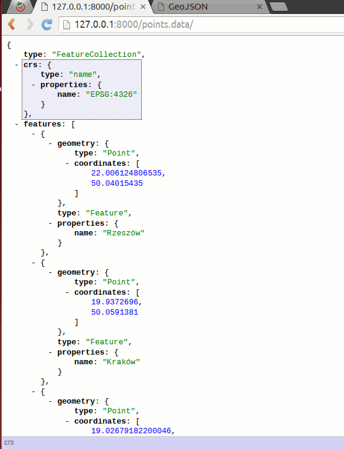

**This is the second post from GeoDjango i Leaflet.js series. You can
find the previous post under this**
[link](/blog/2016/geodjango-leaflet-part-one.html).

After loading data to GeoDjango application now, it's time to present it
to the user. You can use django template tag like `{{object}}` but I
think it's better to provide api endpoints. I will be using GeoDjango
builtin GeoJSON serializer. To do this declare new views in views.py:

```python
from django.http import HttpResponse
from django.core.serializers import serialize
from .models import Point, Voivodeship

def points_view(request):
    points_as_geojson = serialize('geojson', Point.objects.all())
    return HttpResponse(points_as_geojson, content_type='json')

def wojewodztwa_view(request):
    voivodeships_as_geojson = serialize('geojson', Voivodeship.objects.all())
    return HttpResponse(voivodeships_as_geojson, content_type='json')
```

[GeoJSON](http://geojson.org/) is open format for encoding geographical
data. It's based on JSON.

Then add lines to urls.py:

```python
from django.conf.urls import include, url
from django.contrib import admin
from voivodeships.views import points_view, voivodeships_view

urlpatterns = [
    url(r'^admin/', include(admin.site.urls)),
    url(r'^points.data/', points_view, name='points'),
    url(r'^voivodeships.data/', voivodeships_view, name='voivodeships'),
]
```

As you can see GeoDjango displays data from database in GeoJSON:



It's nice but end user need to see results on the map not in JSON format
so I use [Leaflet.js](http://leafletjs.com/).

You can download leaflet.js from the web page but there is a better way:
[django-leaflet](https://github.com/makinacorpus/django-leaflet). It's
django application with allows you embed leaflet to django project.
Install it by:

```bash
$ pip install django-leaflet
```

Then make sure that `leaflet` is added to `INSTALLED_APPS` in
settings.py:

```python
INSTALLED_APPS = (
  # other applications
  leaflet
)
```

Let's add main page view to GeoDjango application in views.py:

```python
from django.views.generic import TemplateView

class MainPageView(TemplateView):
    template_name = 'voivodeships/index.html'
```

And to urls.py:

```python
from voivodeships.views import MainPageView

urlpatterns = [# rest of urls
               url(r'^$', MainPageView.as_view()),]
```

After this add new `index.html` under
`voivodeships/templates/voivodeships/index.html` with this content:

```html
<html>

    <head>
        
        
    </head>
    <body>
        
    </body>
</html>
```

And going to the web page with running GeoDjango application you can see
map:


Thanks to `django-leaflet` you can control behavior of all maps. Let add
the following content to end of settings.py:

```python
LEAFLET_CONFIG = {
  'DEFAULT_CENTER': (52.00,20.00),
  'DEFAULT_ZOOM': 6,
  'MIN_ZOOM': 1,
  'MAX_ZOOM': 20,
}
```

But still map is not taking full space in the web page so let's add more
CSS lines to fix that in index.html:

```html
<head>
   <style media="screen">
     #poland { width:100%; height:100% }
   </style>
   <!-- Rest of html -->
```

One of the Leaflet.js strong points is huge extensions
[database](http://leafletjs.com/plugins.html). In this project I will
use few of them including:
[leaflet-ajax](https://github.com/calvinmetcalf/leaflet-ajax),
[leaflet-spin](https://github.com/makinacorpus/Leaflet.Spin),
[markercluster](https://github.com/Leaflet/Leaflet.markercluster). It's
up to you how you want to install it. I will use
[bower](http://bower.io/) for that:

```bash
$ bower install leaflet-ajax leaflet-spin leaflet.markerculster
```

Add `STATICFILES_DIRS` to settings.py:

```python
STATICFILES_DIRS = (
    os.path.join(BASE_DIR, 'static'),
)
```

After installation got to index.html and use these plugins:

```html

   <head>
      <!-- style tag and django-leaflet tag here -->
      <script src=""></script>
      <script src=""></script>
      <script src=""></script>
   </head>
   <body>
      <script type="text/javascript">
         function map_init_basic (map, options) {
               var geojsonPointLayer = new L.GeoJSON.AJAX("", {
                   onEachFeature:function(feature, layer) {
                        layer.bindPopup(feature.properties.name.toString());
                    }
                });
               geojsonPointLayer.addTo(map);

               var geojsonVoivodeshipsLayer = new L.GeoJSON.AJAX("", {
                   onEachFeature:function(feature, layer) {
                       layer.bindPopup(feature.properties.jpt_nazwa_field.toString());
                   }
               });
               geojsonVoivodeshipsLayer.addTo(map);
           }
      </script>
      
   </body>
```

I added new function `map_init_basic` which is a callback for
django-leaflet tag. Then thanks to leaflet-ajax I get points and
voivodeships GeoJSONs from GeoDjango. Moreover, I use function from
leaflet.js: `onEachFeature`. This function add popup with the name of
point or voivodeship.

There is one problem. GeoJSON with voivodeship is so accurate that
deserializing takes a lot of time (about 41 sec). So one of the solution
is to dump GeoJSON to cache, I will use Redis as a cache database.

First, install and check if Redis is working by:

```bash
$ sudo apt-get install redis-server 
$ redis-cli ping PONG
```

Then it's time to install python bindings:

```bash
$ pip install redis 
$ pip install django-redis-cache
```

After this adjust some settings in settings.py:

```python
MIDDLEWARE_CLASSES = [
    'django.middleware.cache.UpdateCacheMiddleware',
    # ... another middlewares
    'django.middleware.common.CommonMiddleware',
    # ... rest of middlewares
    'django.middleware.cache.FetchFromCacheMiddleware',
]

CACHES = {
    'default': {
        'BACKEND': 'redis_cache.RedisCache',
        'LOCATION': '127.0.0.1:6379',
    },
}
```

What is important in `MIDDLEWARE_CLASSES` is order:
`UpdateCacheMiddleware` should go before `CommonMiddleware` and
`FetchFromCacheMiddleware` is supposed to be last.

Lastly, add cache to `voivodeships_view` in views.py:

```python
from django.core.cache import cache

def voivodeships_view(request):
    redis_key = 'voivodeships'
    voivodeships = cache.get(redis_key)  # getting value for given key from redis
    if not voivodeships:
       voivodeships = serialize('geojson', Voivodeship.objects.all())
       cache.set(redis_key, voivodeships)  # if not GeoJSON is not in cache set it
    return HttpResponse(voivodeships, content_type='json')
```

Right now GeoJSON will be loaded from the database. After reloading the
web page, django will get results from cache.

That's all: you have working GeoDjango application. The github repo is
under this
[link](https://github.com/krzysztofzuraw/personal-blog-projects/tree/master/blog_geodjango_leaflet)

