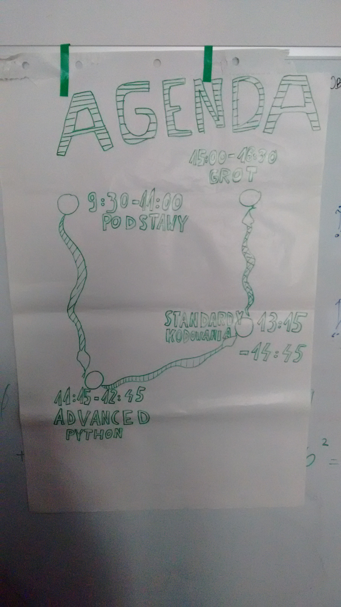

**Hello ! In today's blog post I present my experiences about some
workshop that I have the pleasure to conduct. Later as I promised I will
present exercises and their answers.**

When I joined [STX Next](https://stxnext.com/) I saw an opportunity to
teach people how to write code. I am not experienced guy yet but I
believe that teaching others can have great benefits for me. So when I
heard that 2016 edition of workshops called
[PHP](http://pythonhaspower.com/#) in Wrocław was announced I decided to
take part. By the way, PHP means Python has Power, not any affiliations
with elephants.


*Obligatory selfie from workshop.*

What is exactly this workshop about? In about 7 hours my task was to
present basics of python. I know that it sounds a little bit overwhelmed
but I believe that is a nice start to have.

So what is exactly on agenda?

-   loops, data types, declaration of functions, module importing,
    common operations on data, debugging
-   list/dict comprehensions, generators and iterators
-   pep8, pylint, unittests
-   writing algorithm

As you can see almost all necessary topics are covered. What I really
enjoyed was questions from the audience. People ask me a variety of
questions from how to do something to how I started programming.
Moreover, every 1,5h there was the break on network coffee and one for
pizzas!



*Handwritten agenda with snakes.*

For me, it was a great experience. I was able to teach others and learn
from it!


*Attendees at work.*

At the end of the workshop, I have question about why is that possible
in python

```python
>>> def func(a,b,c):
...     print(a,b,c)
>>> func(c=1,b=2, *(13,))
(13, 1, 2)
```

After some investigation, I found out that positional arguments are
processed before keyword ones. So, in this case, unpacking tuple will
assign `13` to `a`. More on this can be found in [PEP
3102](https://www.python.org/dev/peps/pep-3102/).

Update 18.04.16
---------------

I almost forget to include source code from this workshop. You can find
code and presentation under this github
[repo](https://github.com/stxnext/php-sources).
