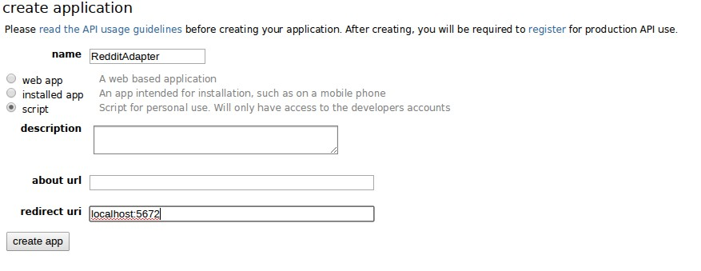
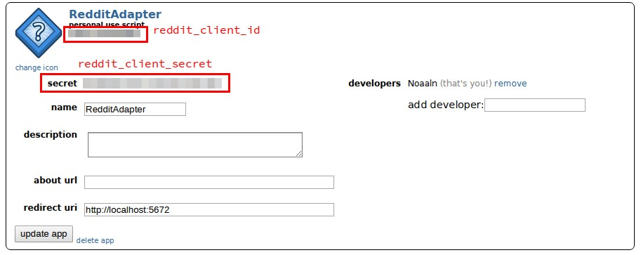

**Welcome! Today I'm going to start series about how to use port and
adapter design pattern in simple django application.**

Let me explain a little bit what exactly ports and adapters design
pattern is. According to this [article](http://a.cockburn.us/1807)
(which by the way I strongly recommend to read) it is a way to separate
business logic from user code.

What I mean by that? Let pretend that you want to create simple django
application which connects to reddit using its API. Then app retrieves
the content of search query provided by the user. After that user can
save for later founded link. In this blog post, I will focus only on
reddit API part. Normally you will write some module using request for
retrieving search results from reddit. But what when it comes to testing
such code? You just mock requests calls or use responses library.

How do you do it in ports and adapters way? You will have one thing
called port for all external connections. Throught this all requests to
external APIs will be done because who knows if the reddit will not
change to duckduckgo? In such case you just add DuckDuckGo Adapter and
you are all set. Because port don't care if there is Reddit adapter or
DuckDuckGo adapter as long as it provides necessary methods. As I
mentioned before, port is communicating only with adapters. And what is
adapter? It is part of code designed only for calling in this case
Reddit API and passing results. To test port you need fake adapter with
all methods that original has. But how you test adapter? You will have
to write integration tests.

Such design pattern is also called hexagonal architecture.


*This is a picture presenting adapters and ports in my application.*

As you can see in above picture all connections to external APIs are
made using ExternalAPIPort so this class in python knows only about the
adapter and that it should have some `search` method for searching. How
is it translating to code?

File `external_api_ports.py`:

```python
class ExternalAPIPort(object):

    def __init__(self, adapter):
        self.adapter = adapter

    def search(self, query, *args, **kwargs):
        return self.adapter.search(query, *args, **kwargs)
```

As you can see port takes adapter in `__init__`. Then in `search` it
uses adapter method for searching and passing results. I only needed the
title of a post that comes from search so I generate them using
generator expression. Moreover here we have *contract* that tell us that
adapter has to have such method as `search` that uses query arguments
(at least).

And how adapter look like?

`reddit_adapter.py`:

```python
import requests
import requests.auth


class RedditAdapter(object):
    def __init__(
        self, reddit_client_id, reddit_client_secret,
        reddit_username, reddit_password
    ):
        self.reddit_client_id = reddit_client_id
        self.reddit_client_secret = reddit_client_secret
        self.reddit_username = reddit_username
        self.reddit_password = reddit_password
        self.reddit_token = None

    def authorize(self):
        client_auth = requests.auth.HTTPBasicAuth(
            self.reddit_client_id,
            self.reddit_client_secret
         )
         post_data = {
              "grant_type": "password",
              "username": self.reddit_username,
              "password": self.reddit_password
         }
         headers = {"User-Agent": "RedditAdapter/0.1 by Krzysztof Zuraw"}
         response = requests.post(
             "https://www.reddit.com/api/v1/access_token",
             auth=client_auth,
             data=post_data,
             headers=headers
         )
         self.reddit_token = response.json()['access_token']

     def search(self, query, subreddit=None):
         self.authorize()
         headers = {
             "Authorization": "bearer {token}".format(token=self.reddit_token),
             "User-Agent": "RedditAdapter/0.1 by Krzysztof Zuraw"
         }
         response = requests.get(
             "https://oauth.reddit.com/r/{subreddit}/"
             "search.json?q={query}&restrict_sr={restrict}".format(
                 subreddit=subreddit,
                 query=query,
                 restrict='on' if subreddit else 'off'
              ),
              headers=headers
         )
         return response.json()

         search_result = []
         for result in raw_response['data']['children']:
             search_result.append(result['data']['title'])

         return search_result
```

What is happening here? Start from `init` (line 6) which takes
`reddit_client_id` and `reddit_client_secret` arguments. There are
created by going to apps tab under preferences:


After that click on create new application on the end of the page and
you will see something like this:



By clicking `create app` you will see that `reddit_client_secret` is
`secret` and `reddit_client_id` is string under `personal use script`.



After initialization, there is method called `authorize` (line 16) which
takes care of proper authorization via [Oauth2](http://oauth.net/2/).

Lastly, there is `search` (line 35) which retrieves JSON response from
reddit API from given subreddit or globally from all subreddits.

So how to test it?

First by creating `FakeRedditAdapter`:

```python
REDDIT_RESPONSE = {
         "kind": "Listing",
         "data": {
             "facets": {},
             "modhash": "",
             "children": [
                 {
                     "kind": "t3",
                     "data": {
                         "domain": "domain",
                         "banned_by": None,
                         "media_embed": {},
                         "subreddit": "django",
                         "selftext_html": None,
                         "selftext": "",
                         "likes": None,
                         "suggested_sort": None,
                         "user_reports": [],
                         "secure_media": None,
                         "link_flair_text": None,
                         "id": "id123",
                         "from_kind": None,
                         "gilded": 0,
                         "archived": False,
                         "clicked": False,
                         "report_reasons": None,
                         "author": "author",
                         "media": None,
                         "score": 20,
                         "approved_by": None,
                         "over_18": False,
                         "hidden": False,
                         "num_comments": 4,
                         "thumbnail": "",
                         "subreddit_id": "id_sub",
                         "hide_score": False,
                         "edited": False,
                         "link_flair_css_class": None,
                         "author_flair_css_class": None,
                         "downs": 0,
                         "secure_media_embed": {},
                         "saved": False,
                         "removal_reason": None,
                         "stickied": False,
                         "from": None,
                         "is_self": False,
                         "from_id": None,
                         "permalink": "/r/django/comments/link",
                         "locked": False,
                         "name": "t3_4b7lzf",
                         "created": 1458511233,
                         "url": "http://url.com",
                         "author_flair_text": None,
                         "quarantine": False,
                         "title": "Post title",
                         "created_utc": 1458482433,
                         "distinguished": None,
                         "mod_reports": [],
                         "visited": False,
                         "num_reports": None,
                         "ups": 20
                     }
                 }
             ],
         "after": None,
         "before": None
         }
     }


class FakeRedditAdapter(object):
    def authorize(self):
        return 'oauth2-authorized-key'

    def search(self, query, subreddit=None):
        search_result = []
        for result in REDDIT_RESPONSE['data']['children']:
            search_result.append(result['data']['title'])            
        return search_result
```

As you can see `FakeRedditAdapter` returns hardcoded response from
reddit API that can be used in test:

```python
import pytest

from tests.utils import FakeRedditAdapter

from reddit_stars.external_api_port import ExternalAPIPort


@pytest.fixture(scope='function')
def reddit_port():
    port = ExternalAPIPort(adapter=FakeRedditAdapter())
    return port


def test_reddit_search(reddit_port):
    assert list(reddit_port.search('test_search')) == ['Post title']
```

That's all for today. In the next post, I will show how to combine these
ports and adapters with django application. Code for this you can find
under this [repo](https://github.com/krzysztofzuraw/reddit-stars).

Changes from 23.05.16:
----------------------
-   Removing coupling from `ExternalAPIPort`
-   Adding new test
-   Adding word about contracts
