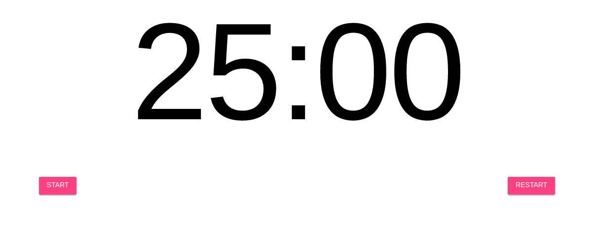

**Welcome to today's blog post! This blog post will be about
implementing countdown in JavaScript and also about some CSS work I have
to do so my timer looks decent.**

Core functionality of pomodoro timer
====================================

As the name suggests the core functionality of a timer is to count down
time. In the case of this timer, I will be using 25 minutes as a timer
that needs to be counted down. I decided that for the time being, I will
have only two control buttons for the timer: start & restart.

Implementing timer in JavaScript
================================

As I know what I want to accomplish the first thing is the look of my
timer. I was wondering if it will be better to write some CSS from
scratch and learn this language too but when I start doing that I
realized that I can spend a whole week only on this task. Instead, I
decided to use [Material Design Lite](https://getmdl.io/). This is a
collection of CSS and JavaScript that allows me to use Google Material
Design. To get started all I need to do is include some code from google
CDN:

```html
<head>
  <link rel="stylesheet" href="https://fonts.googleapis.com/icon?family=Material+Icons">
  <link rel="stylesheet" href="https://code.getmdl.io/1.3.0/material.indigo-pink.min.css">
</head>
<body>
  <script defer src="https://code.getmdl.io/1.3.0/material.min.js"></script>
</body>
```

You may have noticed that script has `defer` attribute which means that
this script will be executed after the document has been parsed. I also
add my custom `style.css`:

```css
.display__time-left {
  font-weight: 100;
  font-size: 20rem;
  margin: 0;
  color: black;
  flex: 1;
  display: flex;
  flex-direction: column;
  align-items: center;
  justify-content: center;
}

.control_buttons {
  flex: 1;
  display: flex;
  justify-content: space-around;
  align-items: center;
}
```

Much of the code from `style.css` is based on Wes Bos code from
[here](https://github.com/wesbos/JavaScript30/blob/master/29%20-%20Countdown%20Timer/style.css).
In `display__time-left` I set up a few properties of the font that will
be showing how many minutes and seconds are still in one pomodoro. I
also made this element
[flex](https://developer.mozilla.org/en-US/docs/Web/CSS/flex) which fits
element in its available space. `.control_buttons` are evenly spaced on
the webpage with space between them by `space-around`. After loading a
page it looks like this:



I am aware that this look needs a bit of work though. As I have my
styles ready I add this HTML to the body:

```html
<body>
<h1 class="display__time-left">25:00</h1>
<div class="control_buttons">
  <button class="mdl-button mdl-js-button mdl-button--raised mdl-js-ripple-effect mdl-button--accent" data-action="start">
    Start
  </button>

  <button class="mdl-button mdl-js-button mdl-button--raised mdl-js-ripple-effect mdl-button--accent" data-action="stop">
    Restart
  </button>
</div>

<audio id="end_sound" src="sound.wav"></audio>
```
At the beginning I show time left in pomodoro which by default is 25
minutes. Next, I have my control buttons with classes from Material
Design Lite. At the end, there is an audio file which I will be playing
at the end of each pomodoro.

How is the counting implemented? For this you need to look into
script.js:

```javascript
let countdown;
const timerDisplay = document.querySelector('.display__time-left');
const startTimeBtn = document.querySelector('[data-action="start"]');
const restartTimeBtn = document.querySelector('[data-action="stop"]');
```

Here I just select necessary elements from HTML. I'm using
`querySelector` to take class and data attributes. As I have my
`startTimeBtn` selected then I add an event listener to it:

```javascript
startTimeBtn.addEventListener('click', () => {
  if (countdown) return;
  timer(1500);
});
```

I'm listening for `click` event and if this happens I set up my timer
for 1500 seconds which is 25 minutes. But before running `timer(1500)` I
check if countdown element is defined. Why? Before the user can click as
many times as he/ she wanted and start the timer from the beginning.
Then I run `timer`:

```javascript
function timer(seconds) {
  const now = Date.now();
  const then = now + (seconds * 1000);
  displayTimeLeft(seconds);

}
```

At the beginning, I define `now` which tells me what is current time
right now. Then I foresee at which time my pomodoro timer will end. Then
I call `displayTimeLeft`:

```javascript
function displayTimeLeft(seconds) {
  const minutes = Math.floor(seconds / 60);
  const remainderSeconds = seconds % 60;
  const display = `${minutes}:${remainderSeconds < 10 ? '0' : ''}${remainderSeconds}`;
  timerDisplay.textContent = display;
}
```

Which is a simple function to display time in `min:sec` format. I
compute `minutes` & `remainderSeconds` and then use es6 template string
to neatly interpolate variables into the string. At the end, I set
`textContent` of my `timerDisplay` which is `h1` HTML element.

Let's go back to `timer`:

```javascript
function timer(seconds) {
  // variables

  countdown = setInterval(() => {
    const secondsLeft = Math.round((then - Date.now()) / 1000);

    if (secondsLeft < 0) {
      clearInterval(countdown);
      playAudio();
      return;
    }

    displayTimeLeft(secondsLeft);
  }, 1000);
```

Here to `countdown`, I assign interval which will be executed every
second. This is the place when this variable is defined and has an
integer value. In the interval I calculate `secondsLeft` and if they are
less than 0 it means it's time to stop interval by `clearInterval`, play
sound and exit the function. At the end, I display changing time.
`playAudio` is a simple function:

```javascript
const endSound = document.querySelector('#end_sound');

function playAudio() {
  const sound = new Audio(endSound.src);
  sound.play();
}
```

By the way most of these functions I take from [JavaScript
30](https://javascript30.com) day 29 by [Wes Bos](http://wesbos.com/).

There is the last thing to do - restart my timer:

```javascript
restartTimeBtn.addEventListener('click', () => {
  clearInterval(countdown);
  countdown = undefined;
  timerDisplay.textContent = '25:00';
});
```

I stop interval, set the `countdown` to `undefined` so I can start my
timer again. I also redisplay remaining time.

What is next?
=============

That's all for today! Thanks for reading but don't worry there is still
a lot to do:

-   checking if pomodoro was good or bad
-   breakes
-   notifications
-   storing good & bad pomodoros

Please feel free to comment! If you have another way to do any of this
don't hesitate and write to me.

Repo with this code is available on
[github](https://github.com/krzysztofzuraw/pomodoro-timer).

Special thanks to Kasia for being an editor for this post. Thank you.
