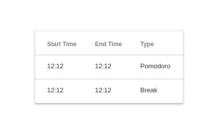

**Hello! In today blog post I will write what I learn during this week
of pomodoro timer development - breaks and localStorage.**

Breaks for pomodoro timer
=========================

The whole idea of pomodoro is that after every 25 minutes of work you
have 5 minutes of break to get up from computer and rest. I wanted to
implement the same in my timer.

As I already have function `timer` to which I pass number of seconds to
countdown, all I need to do is to figure out when to call `timer(300)`
for 5 minutes break.

I did this by passing flag to `timer` called `hasBreakAfter` - if timer
has break after call timer with 300 seconds if not go on with the flow.

```javascript
function timer(seconds, hasBreakAfter = true){
  // function body
  if (secondsLeft < 0){
    makeBreak(hasBreakAfter);
  }
}

function makeBreak(hasBreak) {
  if (hasBreak) {
    timer(300, false);
  }
}
```

I also have to adjust notifications text:

```javascript
// inside if in timer function
displayNotification(hasBreakAfter ? 'Time to rest dude!' : 'Time to work dude!');
```

Displaying & storing breaks and pomodoros
=========================================

I have my breaks and pomodoros but it will be awesome to present it to
the user so he can see how much time he works today.

After notification is displayed I use `saveTimeEntryToLocalStorage`:

```javascript
const entries = JSON.parse(localStorage.getItem('entries')) || [];


function extractHoursMinutes(date) {
  return date.split(' ').splice(4, 1)[0].slice(0, 5);
}

function saveTimeEntryToLocalStorage(startSeconds, endSeconds, type) {
  const startTime = extractHoursMinutes(Date(startSeconds));
  const endTime = extractHoursMinutes(Date(endSeconds));

  const entry = {
    startTime,
    endTime,
    type,
  };
  entries.push(entry);
  localStorage.setItem('entries', JSON.stringify(entries));
}
```

To this function I pass: when given entry starts, end and what type it
was. First thing is to extract hours:minutes from JavaScript `Date`. I
do this in `extractHoursMinutes` by some play with arrays and strings.

JavaScript `Date` returns full
date:`"Sun Mar 05 2017 11:59:19 GMT+0100 (CET)"`. I split this string by
whitespace then I take the fourth element which is
`hours:minutes:seconds` and returns only `hours:minutes`.

I have my start and end time ready I can create `entry` object which
then I add to `entries`. `entries` are JavaScript list of objects from
`localStorage`. If nothing is currently in `localStorage` list is empty.
At the end I store updated entries in localStorage by
`localStorage.setItem()`.

The last thing is to get these entries and render them to the end user:

```javascript
function retrieveTimeEntryFromLocalStorage() {
  tableBody.innerHTML = entries.map(entry => `
      <tr>
        <td class="mdl-data-table__cell--non-numeric">${entry.startTime}</td>
        <td class="mdl-data-table__cell--non-numeric">${entry.endTime}</td>
        <td class="mdl-data-table__cell--non-numeric">${entry.type}</td>
      </tr>
    `).join('');
}
```

Here is iterate over entries and take every one of them add to
respective `td` and save to HTML. Be sure that you spell `HTML` in
`innerHTML` capitalised as I was debugging this error for quite a time.

One more thing is to reset and clear localStorage:

```javascript
resetLocalStorageBtn.addEventListener('click', () => {
  localStorage.clear();
  window.location.reload(true);
});
```

I also reload page without cache by `window.location.reload(true)`.

Entries look as follows:



That's all for today! Feel free to comment - I really appreciate that.
In the next week, I will try to implement good and bad pomodoros.

Repo with this code is available on
[github](https://github.com/krzysztofzuraw/pomodoro-timer).
