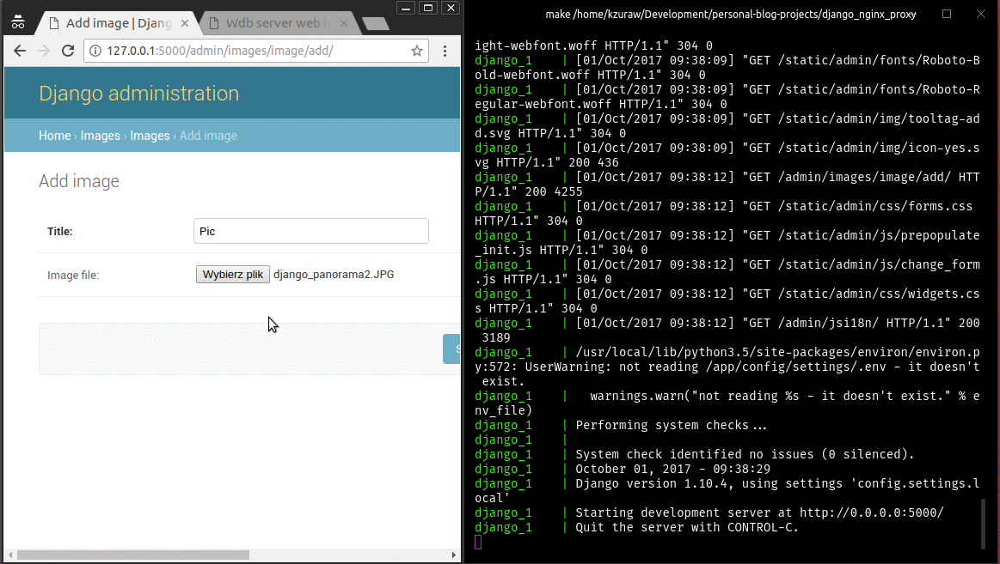

**While I was on PyConPL conference last year I heard about interesting
debugger called wdb. Since then I don't have much chance to find out how
it is to work with the tool. Yet I decided to write a quick blog post
about it. Let's get started!**

What exactly is wdb? From its [github](https://github.com/Kozea/wdb) :

> wdb is a full featured web debugger based on a client-server
> architecture.

It means that I can debug my python based applications inside my browser
even from the different computer. It's using web sockets under the
hood. How can I debug for example django application?

Let's use my django application from Django Nginx blog series:
[repo](https://github.com/krzysztofzuraw/personal-blog-projects/tree/master/django_nginx_proxy).
As it's in docker I only need to add an entry in `docker-compose`:

```yaml
django:
    links:
        - wdb
wdb:
    image: kozea/wdb-server
    ports:
        - "1984:1984"
```

The last thing is to add wdb support to `wsgi.py`:

```python
import os

from django.core.wsgi import get_wsgi_application

os.environ.setdefault("DJANGO_SETTINGS_MODULE", "config.settings.local")

application = get_wsgi_application()

from wdb.ext import WdbMiddleware
application = WdbMiddleware(application)
```

Let's see how it works:



I have to say that I'm really impressed by this project - awesome job!
If you want to have code example go
[here](https://github.com/krzysztofzuraw/personal-blog-projects/tree/master/django_nginx_proxy).

That's all for today!

Cover image by [Ritchie Valens](https://unsplash.com/@ritchievalens) on
[Unsplash](https://unsplash.com/photos/fAMG3PDk830).
